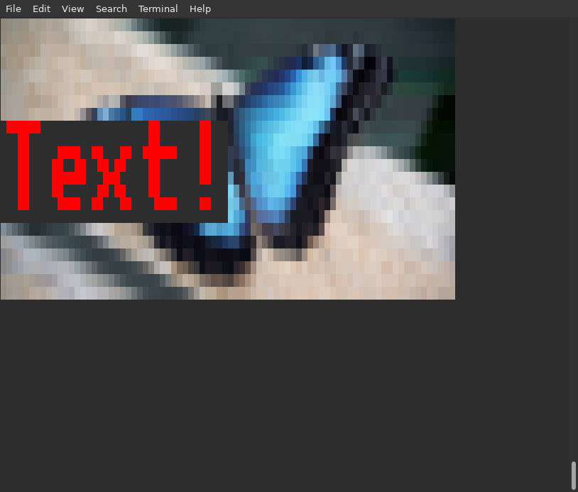

TERMINEDIA
===========

This is a Python library allowing using a text-terminal as a low-resolution graphics
output, along with keyboard realtime reading, and a couple utilities
enough to enable using a text terminal to run simple 2D games or simply rich terminal
apps.

The "noveau" factor is that it uses Unicode quarter-character block combinations
to effectivelly enable 1/4 character "pixels" in the terminal. It also makes
use of 24bit "true" color for text, not limiting itself to the 80's
8 color palette for the terminal.

The development version allows loading image files and displaying those
as colored block chars on the terminal, several terminal-font text effects,
and rendering big-text, 4 or 8 characters tall, by rendering
built-in fonts as images using block characters.

It is designed as a library, providing a discoverable and easy to
use API for drawing, and upon install a few example scripts
will be imediately available as stand-alone scripts
with the "terminedia-" prefix.

The idea is to keep this as a lightweight install - with
as little dependencies as possible.

Documentation
--------------

Check the full documentation at:
    https://terminedia.readthedocs.io/en/stable/

(nb. that documentation is currently for the 0.2 version,
available from pypi. The project's capabilities
evolved far beyond whats is in there, but docs are
still missing - the "TODO.txt" file lists implemented
features or fixes (marked with a "V") and a loose roadmap.
Although for useage and documentation one has to rely
on the doc-strings)

Also, the ``examples`` folder have concrete snippets and
some stress-testing code. The examples
were moved into the main package code, and granted stand-alone
scripts status when the package is pip-installed.

After install, try calling any of the `"terminedia-"` scripts
made available to check the output.

Although incipient in options, some of these example
scripts can work as command line tools. For example
`terminedia-image <image_file>` will downscale and display
an image file in the terminal.

Note that the default pip install won't bring PIL, which results in
limited image support - use `pip install terminedia[images]`,
or simply install PIL directly with `pip install pillow`,
to be able to load arbitrary image files.

Compatibility
--------------

For the time being this is being built in a Posix terminal and relies
on ANSI scape sequences for all terminal manipulation. It should work
in most Linux and Mac OS terminal applications (including non-X11,
"native" terminals on Linux)

The output result will vary according to the terminal
and font used - a nice experience can be achieved
with the "Terminus" font, specially if one is using
the Braille characters for drawing.

License
--------
Terminedia is licensed under GNU's LGPL 3.0 or later, meaning you
are free to use it in whatver project you want, comercial or not,
private or not - you are only required to contribute back any
enhancements you make to this library itself.
For details, please read acompanining "LICENSE" file.
