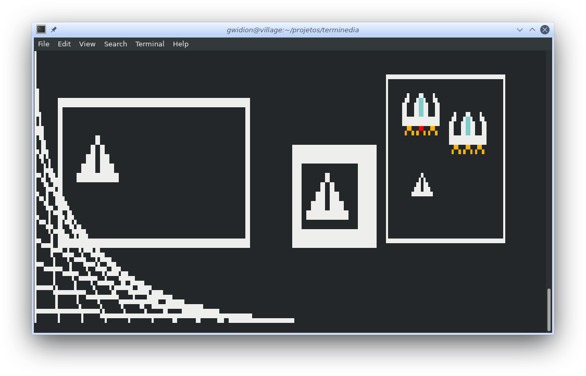
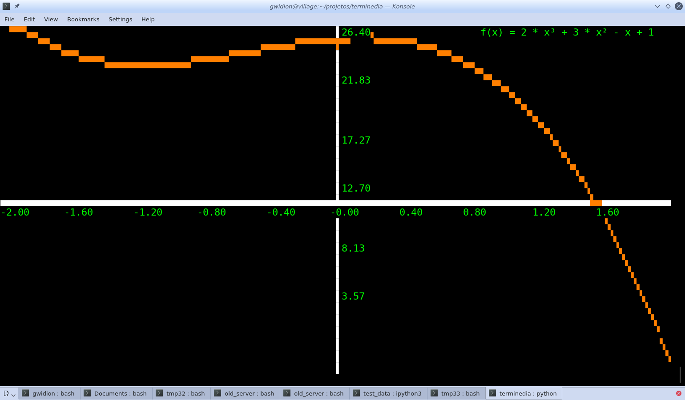

TERMINEDIA
===========

This aims to be a Python library allowing using a text-terminal as a low-resolution graphics
output, along with keyboard realtime reading, mouse events, and a couple utilities
enough to enable using a text terminal to run simple 2D games.

The "noveau" factor is that it uses Unicode quarter-character block combinations
to effectivelly enable 1/4 character "pixels" in the terminal. It also makes
use of 24bit "true" color for text, not limitng itself to the 80's
8 color palette for the terminal.

While at that, it does offer a great deal of flexibility to display
and interface in a text-terminal, and may become an enabler of
rich-interfaces for terminal based applications - think about a
Python-only, modernized Curses library.

The idea is to keep this as a lightweight install - with no, or
as little dependencies as possible.

Documentation
--------------

Check full documentation at:
    https://terminedia.readthedocs.io/en/stable/

Also, the ``examples`` folder have concrete snippets and
some stress-testing code.

Compatibility
--------------

For the time being this is being built in a Posix terminal and relies
on ANSI scape sequences for all terminal manipulation. It should work
in most Linux and Mac OS terminal applications (including non-X11,
"native" terminals on Linux)

License
--------
Terminedia is licensed under GNU's LGPL 3.0 or later, meaning you
are free to use it in whatver project you want, comercial or not,
private or not - you are only required to contribute back any
enhancements you make to this library itself.
For details, please read acompanining "LICENSE" file.
