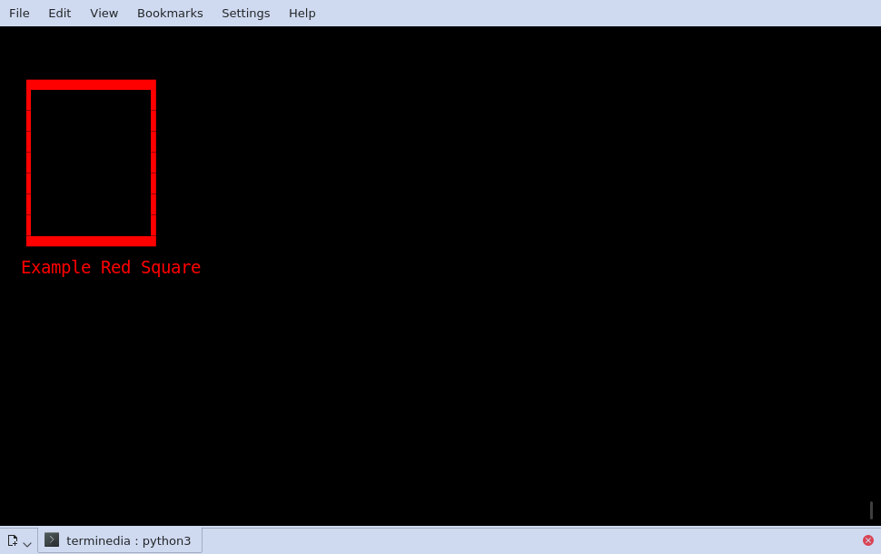

.. terminedia documentation master file, created by
   sphinx-quickstart on Fri Mar 29 23:19:47 2019.
   You can adapt this file completely to your liking, but it should at least
   contain the root `toctree` directive.

Welcome to terminedia's documentation!
======================================

.. toctree::
   :maxdepth: 2
   :caption: Contents:

   terminedia

Indices and tables
==================

* :ref:`genindex`
* :ref:`modindex`
* :ref:`search`

Terminedia is meant to be a lightweight terminal library to
provide color output, positioned text, and use block characters
for displaying low-resolution graphics in the terminal itself.

Simple example: ::

    from terminedia import Screen, pause

    with Screen() as scr:
        scr.context.color = 1, 0, 0
        scr.high.draw.rect((5, 5), (30, 20))

        pause()

This will draw a rougly square rectangle (due to character block non square aspect-ratio)
using 1/4 block unicode characters to draw lines. The output is:

   Text-rectangle drawn on terminal by simple example.

(spacing between blocks will depend on the terminal program, font, and window
 size)

Besides allowing positioning text and graphics, there are resources that allow
non blocking keyboard reading, and capability to read keypresses from the Arrow Keys,
Escape and Function keys- which enables building rich, keyboard based, interfaces
directly in the terminal, as well as simulating a vintage "8-bitish" personal computer
era style games and apps.

The "examples" folder in the project source have other simple examples.

Bellow you will find all the documentation for the library, including
some low-level and internal use modules.
Unless you need to do something too specific, you can make use of the higher level
:any:`Screen` class.

It should be used as a context manager, and within the managed block,
you can use the Screen's instance public methods, as well as its :any:`Screen.context`
attribute to select colors and text-direction, and it's :any:`Screen.draw` attribute to access
drawing primitives, which are the methods avaliable on the :any:`Drawing` class.
Last but not least, the attribute :any:`Screen.high` on the Screen instance enables the use
of 1/4 character "pixels" to draw in a seamless way. Just use the ``.high.draw`` namespace
to access the drawing primitives the same way the ``.draw`` namespace allows
drawing with full-block characters.

For input, the available functionalities are the :any:`keyboard` context manager,
which enables non-blocking use of the keyboard, and the :any:`inkey` and :any:`pause`
functions which make use of this feature.

Terminedia
===========
.. automodule:: terminedia
   :members:
   :imported-members:
   :undoc-members:
   :special-members: __init__,__enter__,__exit__,__contains__,__getitem__,__setitem__
